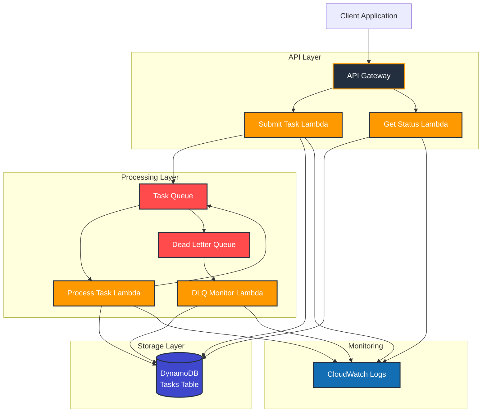
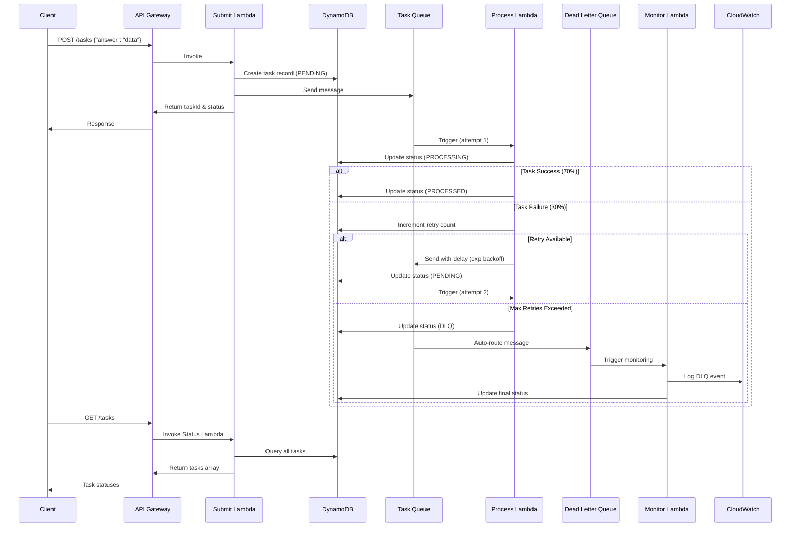

# Fault-Tolerant Task processing - Task Processing with Dead Letter Queue

A Node.js backend built with AWS services that demonstrates task processing with exponential backoff retry strategy and Dead Letter Queue (DLQ) monitoring.

**🚀 Designed for AWS deployment** - Full functionality requires AWS services. Local development has [known limitations](#local-development) with SQS integration.

## Architecture

### High-Level Architecture Diagram



### Component Overview

- **API Gateway + Lambda**: RESTful API for task submission and status retrieval
- **SQS**: Asynchronous task processing queue with retry mechanism
- **DLQ**: Dead Letter Queue for failed tasks after max retries
- **DynamoDB**: Task state storage with full lifecycle tracking
- **Lambda Functions**: Distributed processing and monitoring
- **CloudWatch**: Centralized logging and monitoring

## Features

**AWS Deployment Features:**
- ✅ Task submission via REST API
- ✅ Asynchronous task processing
- ✅ Exponential backoff retry strategy (max 2 retries)
- ✅ Dead Letter Queue for unprocessable tasks
- ✅ DLQ monitoring with CloudWatch logging
- ✅ Task state tracking in DynamoDB
- ✅ 30% random failure simulation
- ✅ TypeScript implementation
- ✅ Serverless Framework deployment

**Local Development Limitations:**
- ⚠️ SQS integration issues - see [Local Development](#local-development) section

## Project Structure

```
src/
├── handlers/           # Lambda function handlers
│   ├── submitTask.ts   # POST /tasks - Submit new task
│   ├── getTaskStatus.ts # GET /tasks - Get all task statuses
│   ├── processTask.ts  # SQS processor with retry logic
│   └── monitorDLQ.ts   # DLQ monitoring and logging
├── services/           # AWS service clients
│   ├── dynamodb.ts     # DynamoDB operations
│   └── sqs.ts          # SQS operations
├── types/              # TypeScript type definitions
│   └── index.ts        # Task and API types
└── utils/              # Utility functions
    └── backoff.ts      # Exponential backoff calculation
```

## Prerequisites

- Node.js 18.x or later
- AWS CLI configured with appropriate permissions
- Serverless Framework CLI

## Installation

1. Clone and install dependencies:
```bash
npm install
```

2. Configure AWS credentials:
```bash
aws configure
```

## Local Development

### ⚠️ Known Limitations

**Current local development setup has limitations with SQS integration:**

#### ✅ What Works Locally:
- **API Gateway + Lambda**: Task submission and status retrieval
- **DynamoDB**: Task storage and retrieval via LocalStack
- **TypeScript compilation**: Code changes with hot reload
- **Basic testing**: API endpoints respond correctly

#### ❌ What Doesn't Work Locally:
- **SQS → Lambda integration**: Tasks get stuck in `PENDING` status
- **Task processing**: `processTask` function not triggered by SQS events
- **Retry mechanism**: No automatic retries occur
- **DLQ processing**: Dead letter queue monitoring not functional

#### 🔄 Current Behavior:
```bash
# Start local development
npm start

# Submit task - works ✅
curl -X POST http://localhost:3000/local/tasks \
  -H 'Content-Type: application/json' \
  -d '{"answer": "test"}'

# Response: {"taskId": "...", "status": "PENDING", ...}

# Check status - works ✅ 
curl http://localhost:3000/local/tasks

# Result: Tasks remain in PENDING status indefinitely ❌
```

### 🚀 Quick Start for Full Testing

For immediate full functionality:
```bash
# Deploy to AWS dev environment
npm run deploy:dev

# Test with real AWS services
npm run test:dev
```

## Deployment

Deploy to AWS:
```bash
# Deploy to dev stage (default)
npm run deploy:dev

# Deploy to production
npm run deploy:prod

# Remove deployment
npm run remove
```

## API Endpoints

After deployment, you'll get API Gateway endpoints:

### Submit Task
```bash
POST https://your-api-id.execute-api.region.amazonaws.com/dev/tasks
Content-Type: application/json

{
  "answer": "Your task answer here"
}
```

Response:
```json
{
  "taskId": "uuid-here",
  "status": "PENDING",
  "message": "Task submitted successfully"
}
```

### Get Task Status
```bash
GET https://your-api-id.execute-api.region.amazonaws.com/dev/tasks
```

Response:
```json
{
  "tasks": [
    {
      "taskId": "uuid-here",
      "answer": "task answer",
      "status": "PROCESSED|FAILED|PENDING|PROCESSING|DLQ",
      "retries": 0,
      "createdAt": "2024-01-01T00:00:00.000Z",
      "updatedAt": "2024-01-01T00:00:00.000Z",
      "errorMessage": "Error details if failed"
    }
  ]
}
```

## Task Processing Flow

### Sequence Diagram



### Processing Steps

1. **Task Submission**: Task submitted via POST /tasks
2. **Queue Processing**: Task sent to SQS queue
3. **Processing**: Lambda processes task (70% success, 30% failure simulation)
4. **Retry Logic**: Failed tasks retry with exponential backoff
5. **DLQ Routing**: Tasks exceeding max retries (2) sent to DLQ
6. **DLQ Monitoring**: DLQ Lambda logs failed task details to CloudWatch

## Retry Strategy

- **Max Retries**: 2 (configurable in serverless.yml)
- **Backoff Formula**: `min(2^retryCount * 2 seconds, 15 minutes)`
- **Retry Delays**: 
  - 1st retry: 2 seconds
  - 2nd retry: 4 seconds
  - After 2 failures: Sent to DLQ

## Task States

- `PENDING`: Task queued for processing
- `PROCESSING`: Task currently being processed
- `PROCESSED`: Task processed successfully
- `FAILED`: Task failed but will retry
- `DLQ`: Task sent to Dead Letter Queue after max retries

## Monitoring

### CloudWatch Logs
- Check Lambda function logs for processing details
- DLQ monitor logs structured JSON for easy querying

### CloudWatch Insights Queries
Query DLQ messages:
```sql
fields @timestamp, taskId, errorMessage, retryCount
| filter eventType = "DLQ_MESSAGE"
| sort @timestamp desc
```

### AWS Console
- **SQS**: Monitor queue depths and message flow
- **DynamoDB**: View task records and status
- **Lambda**: Function metrics and logs

## Configuration

Key configuration in `serverless.yml`:
- **maxReceiveCount**: 3 (initial + 2 retries)
- **visibilityTimeout**: 300 seconds
- **messageRetentionPeriod**: 14 days

## Development

Build TypeScript:
```bash
npm run build
```

View deployment info:
```bash
npm run info
```

View function logs:
```bash
npm run logs -- -f processTask -t
```

## Testing

### AWS Environment Testing (Full Functionality)

Test with curl against deployed AWS environment:
```bash
# Submit a task
curl -X POST https://your-api-id.execute-api.region.amazonaws.com/dev/tasks \
  -H "Content-Type: application/json" \
  -d '{"answer": "test answer"}'

# Check task status (will show PROCESSED/FAILED after processing)
curl https://your-api-id.execute-api.region.amazonaws.com/dev/tasks
```

### Local Testing (Limited Functionality)

Test locally (task submission only):
```bash
# Start local development
npm start

# Submit a task (works)
curl -X POST http://localhost:3000/local/tasks \
  -H "Content-Type: application/json" \
  -d '{"answer": "test answer"}'

# Check task status (will remain PENDING - see Local Development section)
curl http://localhost:3000/local/tasks
```
## Cleanup

Remove all AWS resources:
```bash
npm run remove
```

## Cost Optimization

- DynamoDB: Pay-per-request billing
- Lambda: Pay-per-invocation
- SQS: Pay-per-request
- API Gateway: Pay-per-request

Estimated cost for development/testing: $1-5/month